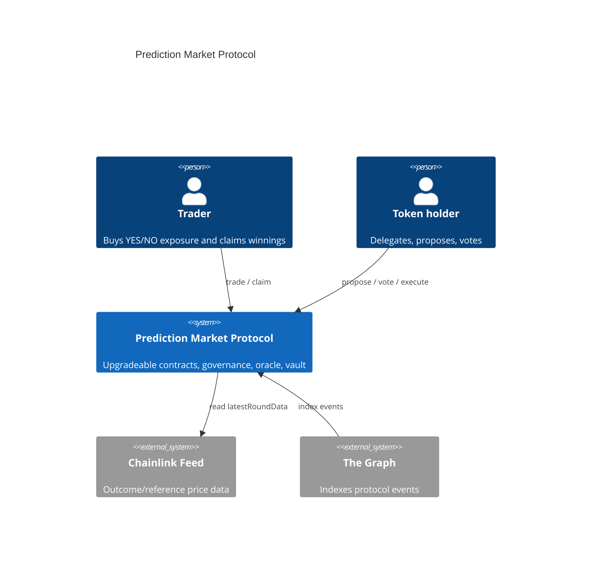
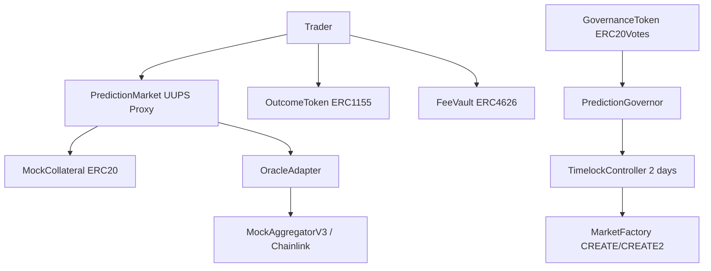
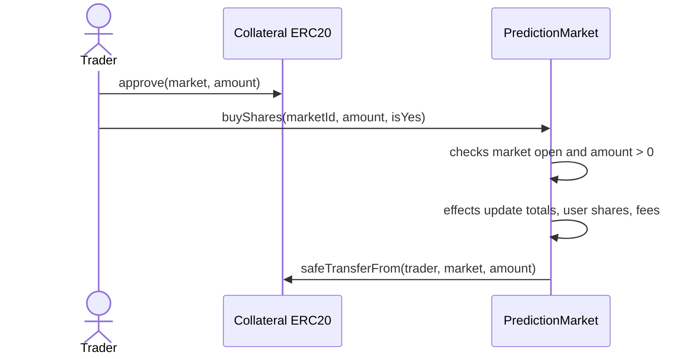
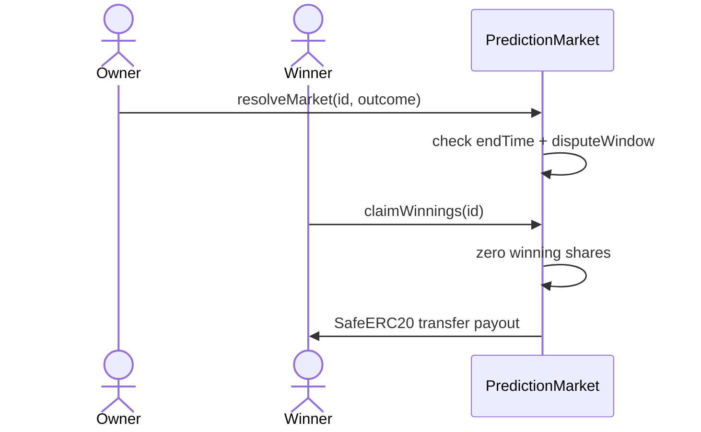
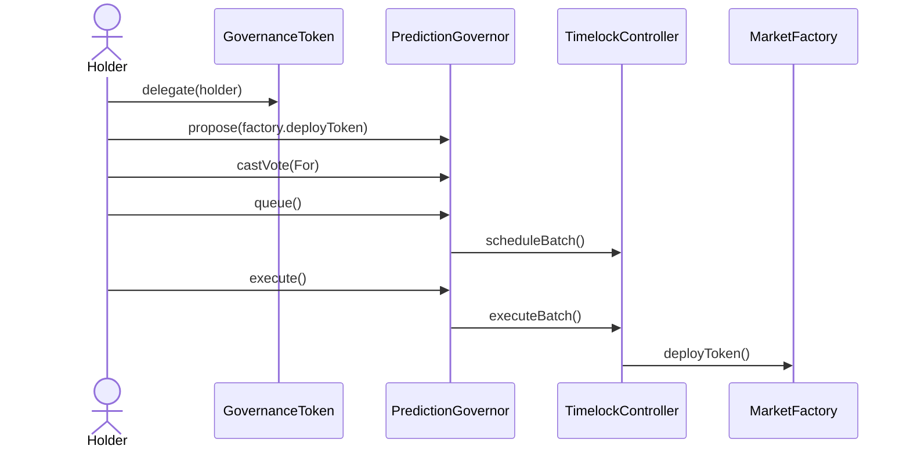

# Architecture Document

## System Context

## Contract Relationships

## Critical Flows

### Buy Shares

### Resolve and Claim

### Governance Lifecycle

## Storage Layout

Upgradeable storage is isolated in `PredictionMarket` behind `ERC1967Proxy`.

| Slot group | Variable |
|---|---|
| inherited | Initializable, UUPS, Ownable2Step, ReentrancyGuard, Pausable |
| protocol | `collateralToken`, `marketCount`, `feeBps`, `accumulatedFees`, `disputeWindow` |
| mappings | `markets`, `yesShares`, `noShares` |

No V2 state is added yet. The documented upgrade path is append-only storage: future variables must be added after the current mappings and never reorder existing fields.

## Trust Assumptions

- Market owner can create markets, resolve outcomes, pause/unpause, set fees and dispute window, withdraw fees, and authorize upgrades.
- Timelock controls factory deployment in the governance demo.
- Token holders control governance if they have delegated voting power.
- Chainlink feed freshness is trusted up to `maxAge`; stale or negative prices revert.

## Design Patterns

- Factory: `MarketFactory` deploys collateral tokens via CREATE and CREATE2.
- UUPS proxy: `PredictionMarket` is upgradeable and tested.
- Checks-Effects-Interactions: `buyShares` and `claimWinnings` update accounting before token transfers.
- Reentrancy Guard: state-changing token-flow functions use `nonReentrant`.
- Pausable: emergency circuit breaker.
- Oracle Adapter: `OracleAdapter` isolates feed interface and staleness logic.
- Timelock: governance actions execute through `TimelockController`.

## ADR Summary

1. **UUPS over Transparent Proxy**: UUPS keeps proxy small and puts upgrade authorization in the implementation.
2. **ERC20Votes for governance**: OpenZeppelin Votes gives snapshot-based voting power and delegation.
3. **Timelock delay**: 2 days gives users time to react to passed proposals.
4. **ERC1155 outcome shares**: one contract can represent YES/NO shares for every market.
5. **ERC4626 fee vault**: standard vault interface makes fee accounting auditable.
